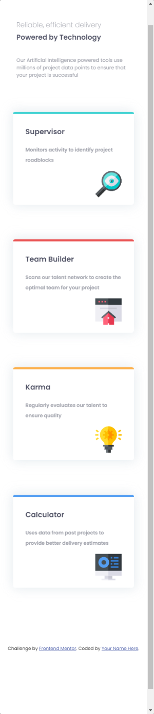
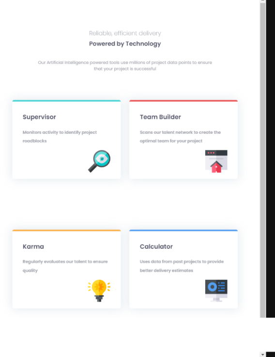
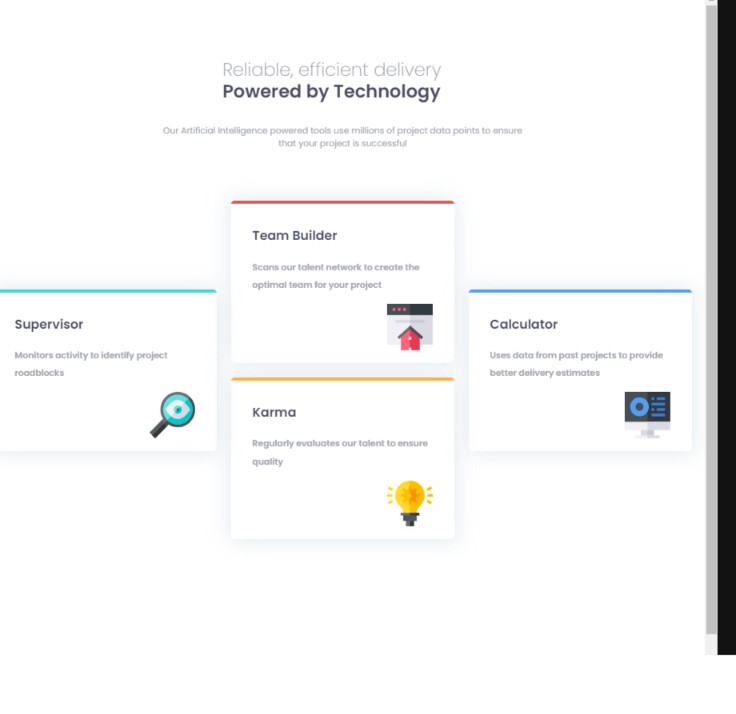

# Frontend Mentor - Four card feature section solution

This is a solution to the [Four card feature section challenge on Frontend Mentor](https://www.frontendmentor.io/challenges/four-card-feature-section-weK1eFYK). Frontend Mentor challenges help you improve your coding skills by building realistic projects. 

## Table of contents

- [Overview](#overview)
  - [The challenge](#the-challenge)
  - [Screenshot](#screenshot)
  - [Links](#links)
- [My process](#my-process)
  - [Built with](#built-with)
  - [What I learned](#what-i-learned)
  - [Continued development](#continued-development) 
- [Author](#author)


**Note: Delete this note and update the table of contents based on what sections you keep.**

## Overview
The 4-card challenge consists of building 4 cards that show a message and an image and, depending on the type of device, show a specific view.

### The challenge

Users should be able to:

- View the optimal layout for the site depending on their device's screen size

### Screenshot

 




Add a screenshot of your solution. The easiest way to do this is to use Firefox to view your project, right-click the page and select "Take a Screenshot". You can choose either a full-height screenshot or a cropped one based on how long the page is. If it's very long, it might be best to crop it.

Alternatively, you can use a tool like [FireShot](https://getfireshot.com/) to take the screenshot. FireShot has a free option, so you don't need to purchase it. 

Then crop/optimize/edit your image however you like, add it to your project, and update the file path in the image above.

**Note: Delete this note and the paragraphs above when you add your screenshot. If you prefer not to add a screenshot, feel free to remove this entire section.**

### Links

- Solution URL: [Add solution URL here](https://github.com/cyeguez/four-card-feature-section-master)
- Live Site URL: [Add live site URL here](https://cyeguez.github.io/four-card-feature-section-master/)

## My process
I started the project by looking at the instructions, creating the repository, copying the colors and fonts, creating the variables, prepared the project to use sass , then proceeded to set the element tags in the html document, then used figma to get an idea of ​​it. the measurements of the elements.
### Built with

- Semantic HTML5 markup
- CSS custom properties
- Flexbox
- CSS Grid
- Mobile-first workflow
- SASS
-FIGMA

**Note: These are just examples. Delete this note and replace the list above with your own choices**

### What I learned


In the Desktop view I used grid, I don't know why I'm a bit scared of using it, but I used the chrome dev-tool and started to observe the lines of the grid and placed element by element where I wanted, I got more and more excited when I pressed enter and the element was placed in its position.
To see how you can add code snippets, see below:

```html
<div class="card card--red">
          <h3>Team Builder</h3>
          <p>Scans our talent network to create the optimal team for your project</p>
          
        </div>
```
```css
//**--- Main styles---**//

  .card__container {
    display: grid;
    place-items: center;
    grid-template-columns: repeat(3, 250px);
    grid-template-rows: repeat(3, 200px);

    & .card--red {
      grid-column: 2/3;
      grid-row: 1/2;
      margin-top: 205px;
    }
    & .card--cyan {
      grid-column: 1/2;
      grid-row: 2/3;
      margin-left: -110px;
    }
    & .card--orange {
      grid-column: 2/3;
      grid-row: 3/4;
      margin-top: -205px;
      
    }
    & .card--blue {
      

      grid-column: 3/4;
      grid-row: 2/3;
      margin-left: 110px;
    }
  }
```


If you want more help with writing markdown, we'd recommend checking out [The Markdown Guide](https://www.markdownguide.org/) to learn more.

**Note: Delete this note and the content within this section and replace with your own learnings.**

### Continued development

I want to continue advancing in the frontend and js and at some point be a pro in react

**Note: Delete this note and the content within this section and replace with your own plans for continued development.**

### Useful resources

- [Example resource 1](https://www.example.com) - This helped me for XYZ reason. I really liked this pattern and will use it going forward.
- [Example resource 2](https://www.example.com) - This is an amazing article which helped me finally understand XYZ. I'd recommend it to anyone still learning this concept.

**Note: Delete this note and replace the list above with resources that helped you during the challenge. These could come in handy for anyone viewing your solution or for yourself when you look back on this project in the future.**

## Author

- Website - [GITHUB](https://github.com/cyeguez)
- Frontend Mentor - [@cyeguez](https://www.frontendmentor.io/profile/cyeguez)

**Note: Delete this note and add/remove/edit lines above based on what links you'd like to share.**


